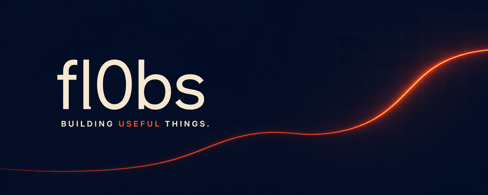

<p align="center">
  
</p>

<p align="center">
  <a href="https://github.com/fl0bs?tab=followers"></a>
  <a href="https://github.com/fl0bs"></a>
  <a href="mailto:fl0bs@protonmail.com"></a>
</p>

## Hey, I’m fl0bs 👋

I’m an independent developer who enjoys turning frustrating, repetitive tasks into focused products that feel effortless. I care about useful automation, thoughtful interfaces, privacy, and the small details that make software pleasant to use.

> I don’t just want software to work. I want it to feel obvious.

```text
Based in        France
Currently       Building Klaimz and some other projects..
Interested in   Browser extensions · automation · product design · building softwares and websites
Open to         Collaborations · ambitious ideas · useful open source
```

## What I’m building

<table>
  <tr>
    <td width="64" align="center">
      
    </td>
    <td>
      <h3>Klaimz</h3>
      <p>A privacy-first browser extension that finds limited-time free games and assets across Steam, Epic Games, GOG, Fab, and Indie Gala.</p>
      <p>
        <a href="https://github.com/fl0bs/klaimz"><strong>Explore the project →</strong></a>
      </p>
    </td>
  </tr>
</table>

## My toolbox

<p>
  
  
  
  
  
  
  
  
  
  
  
  
  
  
  
  
  
</p>

## How I build

- **Useful first** — solve a real problem before adding decoration.
- **Private by design** — keep user data local whenever possible.
- **Automation with guardrails** — save time without hiding important decisions.
- **Interfaces with intent** — hierarchy, motion, copy, and feedback all matter.
- **Ship, observe, refine** — quality comes from disciplined iteration.

## Let’s make something worth using

Have a product idea, a strange technical problem, or an open-source project that deserves more care? I’m always interested in thoughtful conversations and useful collaborations.

<p align="center">
  <a href=""></a>
  <a href="mailto:fl0bs@protonmail.com"></a>
</p>

<p align="center">
  <sub>Designed with intent · Built by <strong>fl0bs</strong></sub>
</p>
